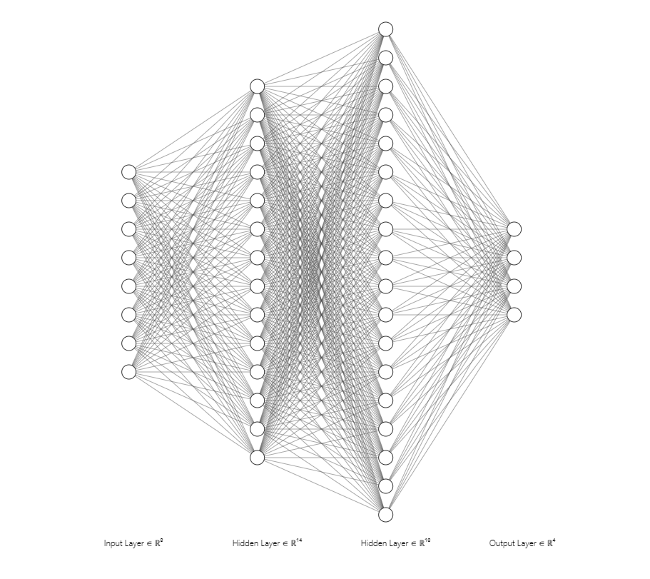
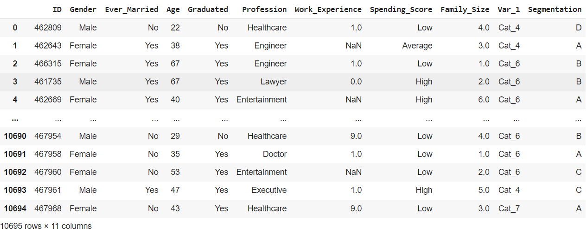
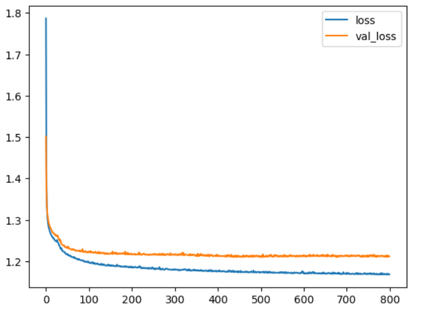
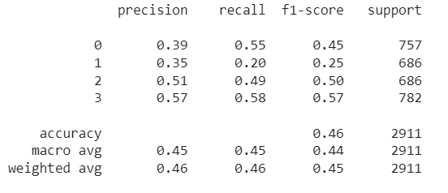
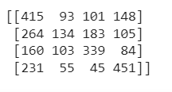
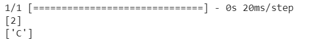

# Developing a Neural Network Classification Model

## AIM

To develop a neural network classification model for the given dataset.

## Problem Statement

An automobile company has plans to enter new markets with their existing products. After intensive market research, they’ve decided that the behavior of the new market is similar to their existing market.

In their existing market, the sales team has classified all customers into 4 segments (A, B, C, D ). Then, they performed segmented outreach and communication for a different segment of customers. This strategy has work exceptionally well for them. They plan to use the same strategy for the new markets.

You are required to help the manager to predict the right group of the new customers.

## Neural Network Model



## DESIGN STEPS

### STEP 1:
Import the required packages

### STEP 2:
Import the dataset to manipulate on

### STEP 3:
Clean the dataset and split to training and testing data

### STEP 4:
Create the Model and pass appropriate layer values according the input and output data

### STEP 5:
Compile and fit the model

### STEP 6:
Load the dataset into the model

### STEP 7:
Test the model by predicting and output

## PROGRAM
```
Developed by: M.Hariharan
Register no: 212221230034
```
### Importing the require packages
```
import pandas as pd
from sklearn.model_selection import train_test_split
from tensorflow.keras.models import Sequential
from tensorflow.keras.models import load_model
import pickle
from tensorflow.keras.layers import Dense
from tensorflow.keras.layers import Dropout
from tensorflow.keras.layers import BatchNormalization
import tensorflow as tf
import seaborn as sns
from tensorflow.keras.callbacks import EarlyStopping
from sklearn.preprocessing import MinMaxScaler
from sklearn.preprocessing import LabelEncoder
from sklearn.preprocessing import OneHotEncoder
from sklearn.preprocessing import OrdinalEncoder
from sklearn.metrics import classification_report,confusion_matrix
import numpy as np
import matplotlib.pylab as plt
```

### Importing the dataset
```
data=pd.read_csv("customers.csv")
```

### Data exploration
```
data.columns
data.dtypes
data.shape
data.isnull().sum()
data=data.dropna(axis=0)
data.shape
data.dtypes
for column in data.columns:
    column_names.append(column)
    unique_values = data[column].dropna().unique()  # Drop NaN values
    unique_values_list.append(unique_values.tolist())
from sklearn.preprocessing import OrdinalEncoder
categories_list=[['Male', 'Female'],['No', 'Yes'],['No', 'Yes'],['Healthcare', 'Engineer', 'Lawyer', 'Artist', 'Doctor',
       'Homemaker', 'Entertainment', 'Marketing', 'Executive'],['Low', 'High', 'Average']]
enc=OrdinalEncoder(categories=categories_list)
data1=data.copy()
data1[['Gender','Ever_Married','Graduated','Profession','Spending_Score']]=enc.fit_transform(data1[['Gender','Ever_Married','Graduated','Profession','Spending_Score']])
data1=data1.drop('ID',axis=1)
data1=data1.drop('Var_1',axis=1)
```
### Encoding of output values
```
from sklearn.preprocessing import LabelEncoder
le=LabelEncoder()
data1['Segmentation']=le.fit_transform(data1['Segmentation'])
onehot=OneHotEncoder()
onehot.fit(y1)
y=onehot.transform(y1).toarray()
X=data1.iloc[:,:-1].values
y1=data1.iloc[:,-1].values.reshape(-1,1)
```
### Spliting the data
```
from sklearn.model_selection import train_test_split
xtrain,xtest,ytrain,ytest=train_test_split(X,y,test_size=0.33,random_state=50)
```
### Scaling the features of input
```
from sklearn.preprocessing import MinMaxScaler
scaler=MinMaxScaler()
scaler.fit(xtrain[:,2].reshape(-1,1))
xtrain_scaled=np.copy(xtrain)
xtest_scaled=np.copy(xtest)
xtrain_scaled[:,2]=scaler.transform(xtrain[:,2].reshape(-1,1)).reshape(-1)
xtest_scaled[:,2]=scaler.transform(xtest[:,2].reshape(-1,1)).reshape(-1)
```
### Creation of model
```
ai_brain=Sequential([
    Dense(14,input_shape=(8,)),
    Dense(18,activation='relu'),
    Dense(4,activation='softmax')
])
ai_brain.compile(optimizer='adam',loss='categorical_crossentropy',metrics=['accuracy'])
ai_brain.fit(x=xtrain_scaled,y=ytrain,epochs=500,batch_size=256,validation_data=(xtest_scaled,ytest),)
```
### ploting the metrics
```
metrics = pd.DataFrame(ai_brain.history.history)
metrics.head()
metrics[['loss','val_loss']].plot()
```
### Making the prediction
```
x_test_predictions = np.argmax(ai_brain.predict(xtest_scaled), axis=1)
x_test_predictions.shape
print(confusion_matrix(y_test_truevalue,x_test_predictions))
print(classification_report(y_test_truevalue,x_test_predictions))
```
### Making the prediction for single input
```
x_single_prediction = np.argmax(ai_brain.predict(xtest_scaled[1:2,:]), axis=1)
print(x_single_prediction)
print(le.inverse_transform(x_single_prediction))
```
### Saving and loading the model
```
ai_brain.save('customer_classification_model.h5')
with open('customer_data.pickle', 'wb') as fh:
   pickle.dump([X_train_scaled,y_train,X_test_scaled,y_test,customers_1,customer_df_cleaned,scaler_age,enc,one_hot_enc,le], fh)
ai_brain = load_model('customer_classification_model.h5')
with open('customer_data.pickle', 'rb') as fh:
   [X_train_scaled,y_train,X_test_scaled,y_test,customers_1,customer_df_cleaned,scaler_age,enc,one_hot_enc,le]=pickle.load(fh)
```
## Dataset Information



## OUTPUT

### Training Loss, Validation Loss Vs Iteration Plot



### Classification Report



### Confusion Matrix




### New Sample Data Prediction



## RESULT
A neural network classification model is developed for the given dataset.
